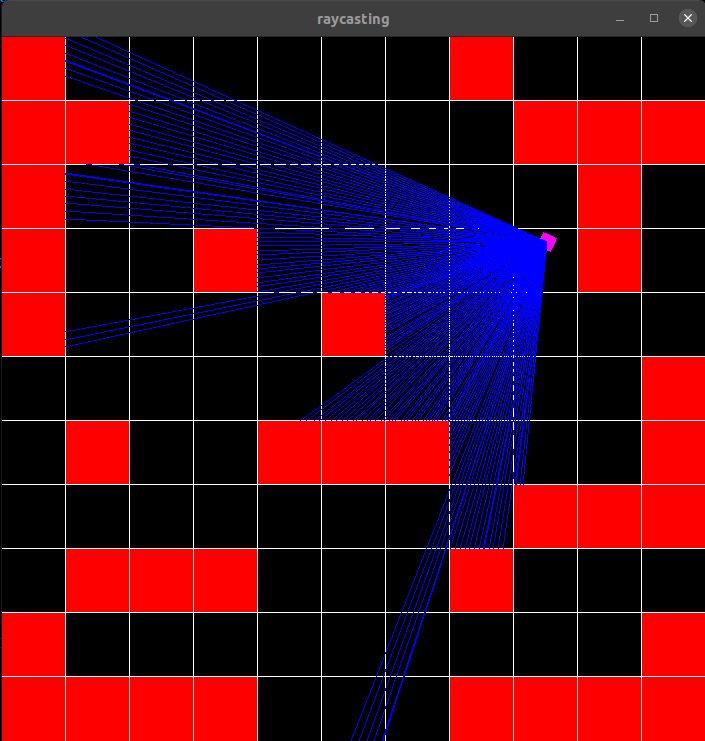

# **Raycaster**

This is my first C++ project. It's a raycaster that uses the SFML graphic library. For now I haven't implemented the 3d rendering of the 2D maps, but I will do it eventually, as well as fix some minor bugs.

  

## **Compilation and execution**  

`make` : compiles the code, puts the .o files in obj/ directory and executable in bin/ directory (after creating them).  
`make clean` : deletes the obj/ and bin/ directory and their content.  

To execute, use `./bin/main` after compilation. You can then enter the path of a .txt file that contains a map (see maps/ directory for examples).

Enjoy :wink:  

